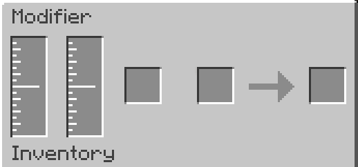

---
navigation:
    title: Modifier
    icon: 'castingtools:modifier'
    parent: index.md
    position: 80
item_ids:
    - 'castingtools:modifier'

---

# Modifier

## Modifier

The Modifier can be used to modify tools and armor. Standing on top of the modifier will fill with the players molten experience. Searching for the uses of tools / armor will show you the modifiers that can be added to the item. Adding modifiers requires molten experience as well as either an item and or fluid depending on the modifier

### GUI
The left tank is for molten experience, this tank can also be filled if the player stands on top of the modifier. The tank next to that is the fluid input tank. The first item slot is items that are needed to add the modifier, the seconds slot is for the item you want to modify like tools and armor. The right slot is a preview of the resulting item. Once taken out the fluid and / or items will be consumed and the modifier is added

### Troubleshooting
If the modifier isn't showing a modified output make sure you have enough molten experience and the correct items and fluids for the modifier you want to add.
