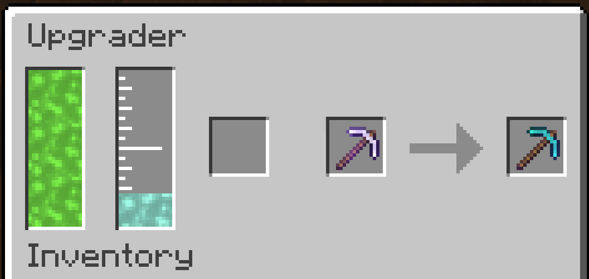

---
navigation:
    title: Upgrader
    icon: 'castingtools:upgrader'
    parent: index.md
    position: 81
item_ids:
    - 'castingtools:upgrader'

---

# Upgrader

## Upgrader

The Upgrader is a powerful block that allows you to upgrade your equipment into new ones. For example, turning a modified Iron Pickaxe into a Modified Diamond Pickaxe. The Upgrader will copy everything from the original item and apply it to the new one. Requires Experience in the tank to use. The Upgrader can use the Molten variant of the material or the item to make the upgraded item. For example, Molten Diamond or Dimaond can be used to upgrade Equipment to Diamond 

### GUI
The left tank is for molten experience, this tank can also be filled if the player stands on top of the upgrader. The tank next to that is the fluid input tank. The first item slot is the material that you want to upgrade the equipment with eg diamond for a Diamond Pickaxe. The right slot is a preview of the resulting item. Once taken out, the fluid or items will be consumed and the upgraded equipment is made.

### Troubleshooting
If the modifier isn't showing a modified output make sure you have enough molten experience and the correct items and fluids for the modifier you want to add. Note the Upgrade will always try to use the items first not fluid.
